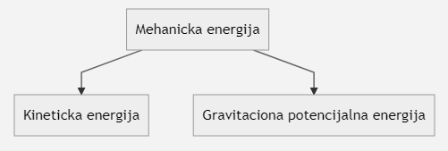

# Fizičke formule
## 6. razred

## 7. razred

## 8. razred
### Oscilatorno kretanje
Elongacija:  
&nbsp;&nbsp;&nbsp;&nbsp;- Trenutna udaljenost od ravnotežnog položaja  
&nbsp;&nbsp;&nbsp;&nbsp;- Oznaka:  <!--$x$-->  
&nbsp;&nbsp;&nbsp;&nbsp;- Merna jedinica:  <!--$[x] = 1m$-->  

Amplituda:  
&nbsp;&nbsp;&nbsp;&nbsp;- Maksimalna udaljenost od ravnotežnog položaja  
&nbsp;&nbsp;&nbsp;&nbsp;- Oznaka: $x_o$  
&nbsp;&nbsp;&nbsp;&nbsp;- Merna jedinica: $[x_o] = 1m$  

Period oscilovanja:  
&nbsp;&nbsp;&nbsp;&nbsp;- Vreme potrebno da se izvrši jedna puna oscilacija  
&nbsp;&nbsp;&nbsp;&nbsp;- Oznaka: $T$  
&nbsp;&nbsp;&nbsp;&nbsp;- Merna jedinica: $[T] = 1s$  
&nbsp;&nbsp;&nbsp;&nbsp;$T = \frac{t}{n}$  
&nbsp;&nbsp;&nbsp;&nbsp;$t - vreme oscilacija$  
&nbsp;&nbsp;&nbsp;&nbsp;$n - broj oscilacija$  

Frekvencija:  
&nbsp;&nbsp;&nbsp;&nbsp;- Broj oscilacija u jedinici vremena  
&nbsp;&nbsp;&nbsp;&nbsp;- Oznaka: $\nu$ ("ni")  
&nbsp;&nbsp;&nbsp;&nbsp;- Merna jedinica: $[\nu] = 1Hz$  
&nbsp;&nbsp;&nbsp;&nbsp;$\nu = \frac{n}{t}$  
&nbsp;&nbsp;&nbsp;&nbsp;- Veza između perioda i frekvencije  
&nbsp;&nbsp;&nbsp;&nbsp;$$T = \frac{1}{\nu}$$ $$\nu = \frac{1}{t}$$ $$1Hz = \frac{1}{s}$$  

### Zakon o održanju mehaničke energije pri oscilovanju tela
  
&nbsp;&nbsp;&nbsp;&nbsp;&nbsp;&nbsp;&nbsp;&nbsp;$E_k = \frac{m\times v}{2}$&nbsp;&nbsp;&nbsp;&nbsp;&nbsp;&nbsp;&nbsp;&nbsp;&nbsp;&nbsp;&nbsp;&nbsp;&nbsp;&nbsp;&nbsp;&nbsp;&nbsp;&nbsp;&nbsp;&nbsp;&nbsp;&nbsp;&nbsp;&nbsp;&nbsp;&nbsp;&nbsp;&nbsp;$E_p = m\times g\times h$  

### Brzina mehaničkog talasa
&nbsp;&nbsp;&nbsp;&nbsp;- Oznaka: $u$  
&nbsp;&nbsp;&nbsp;&nbsp;- Formula: $u = \frac{\lambda}{T}$ &nbsp;&nbsp;&nbsp;&nbsp; $u = \frac{s}{t}$ &nbsp;&nbsp;&nbsp;&nbsp; $u = \lambda \times \nu$  
&nbsp;&nbsp;&nbsp;&nbsp;- Merna jedinica: $[u] = 1\frac{m}{s}$  
