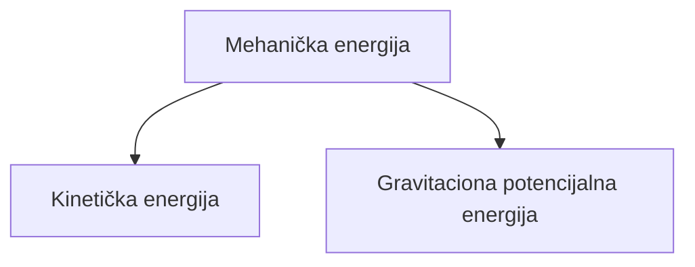

# Fizičke formule
## 6. razred

## 7. razred

## 8. razred
### Oscilatorno kretanje
Elongacija:
&nbsp;&nbsp;&nbsp;&nbsp;- Trenutna udaljenost od ravnotežnog položaja
&nbsp;&nbsp;&nbsp;&nbsp;- Oznaka: $x$
&nbsp;&nbsp;&nbsp;&nbsp;- Merna jedinica: $[x] = 1m$

Amplituda:
&nbsp;&nbsp;&nbsp;&nbsp;- Maksimalna udaljenost od ravnotežnog položaja
&nbsp;&nbsp;&nbsp;&nbsp;- Oznaka: $x_o$
&nbsp;&nbsp;&nbsp;&nbsp;- Merna jedinica: $[x_o] = 1m$

Period oscilovanja:
&nbsp;&nbsp;&nbsp;&nbsp;- Vreme potrebno da se izvrši jedna puna oscilacija
&nbsp;&nbsp;&nbsp;&nbsp;- Oznaka: $T$
&nbsp;&nbsp;&nbsp;&nbsp;- Merna jedinica: $[T] = 1s$
&nbsp;&nbsp;&nbsp;&nbsp;$T = \frac{t}{n}$
&nbsp;&nbsp;&nbsp;&nbsp;$t - vreme oscilacija$
&nbsp;&nbsp;&nbsp;&nbsp;$n - broj oscilacija$

Frekvencija:
&nbsp;&nbsp;&nbsp;&nbsp;- Broj oscilacija u jedinici vremena
&nbsp;&nbsp;&nbsp;&nbsp;- Oznaka: $\nu$ ("ni")
&nbsp;&nbsp;&nbsp;&nbsp;- Merna jedinica: $[\nu] = 1Hz$
&nbsp;&nbsp;&nbsp;&nbsp;$\nu = \frac{n}{t}$
&nbsp;&nbsp;&nbsp;&nbsp;- Veza između perioda i frekvencije
&nbsp;&nbsp;&nbsp;&nbsp;$$T = \frac{1}{\nu}$$ $$\nu = \frac{1}{t}$$ $$1Hz = \frac{1}{s}$$

### Zakon o održanju mehaničke energije pri oscilovanju tela

&nbsp;&nbsp;&nbsp;&nbsp;&nbsp;&nbsp;&nbsp;&nbsp;$E_k = \frac{m\times v}{2}$&nbsp;&nbsp;&nbsp;&nbsp;&nbsp;&nbsp;&nbsp;&nbsp;&nbsp;&nbsp;&nbsp;&nbsp;&nbsp;&nbsp;&nbsp;&nbsp;&nbsp;&nbsp;&nbsp;&nbsp;&nbsp;&nbsp;&nbsp;&nbsp;&nbsp;&nbsp;&nbsp;&nbsp;$E_p = m\times g\times h$

### Brzina mehaničkog talasa
&nbsp;&nbsp;&nbsp;&nbsp;- Oznaka: $u$
&nbsp;&nbsp;&nbsp;&nbsp;- Formula: $u = \frac{\lambda}{T}$ &nbsp;&nbsp;&nbsp;&nbsp; $u = \frac{s}{t}$ &nbsp;&nbsp;&nbsp;&nbsp; $u = \lambda \times \nu$
&nbsp;&nbsp;&nbsp;&nbsp;- Merna jedinica: $[u] = 1\frac{m}{s}$
